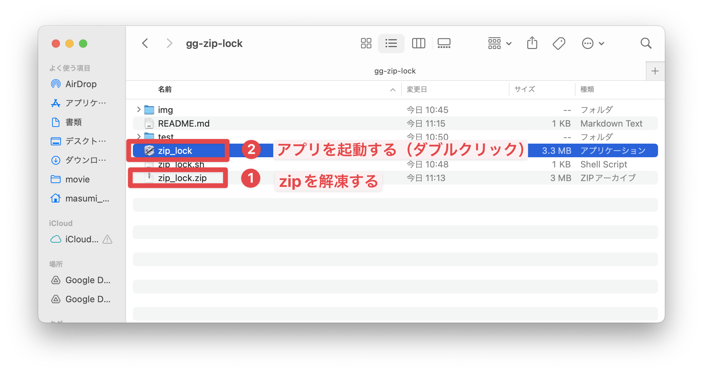
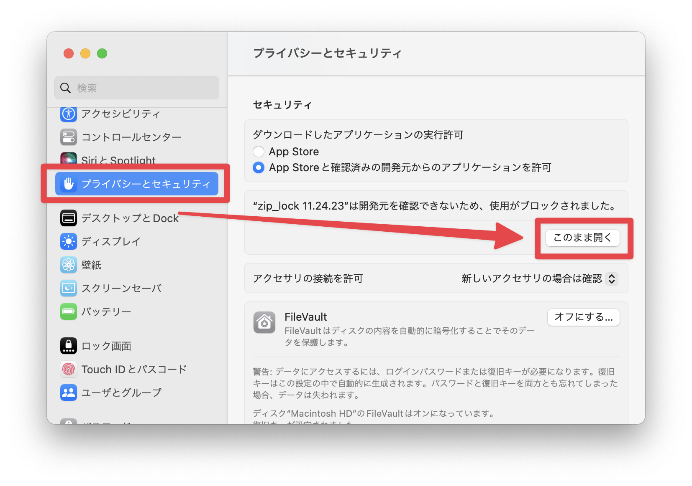
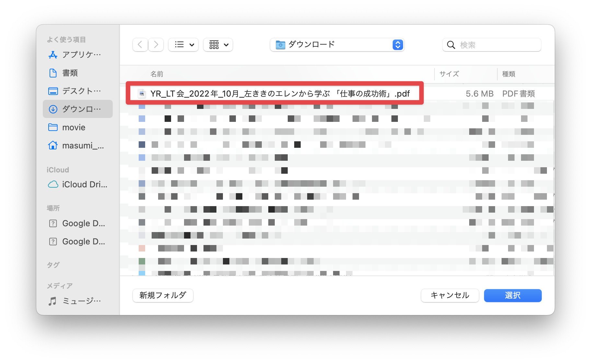
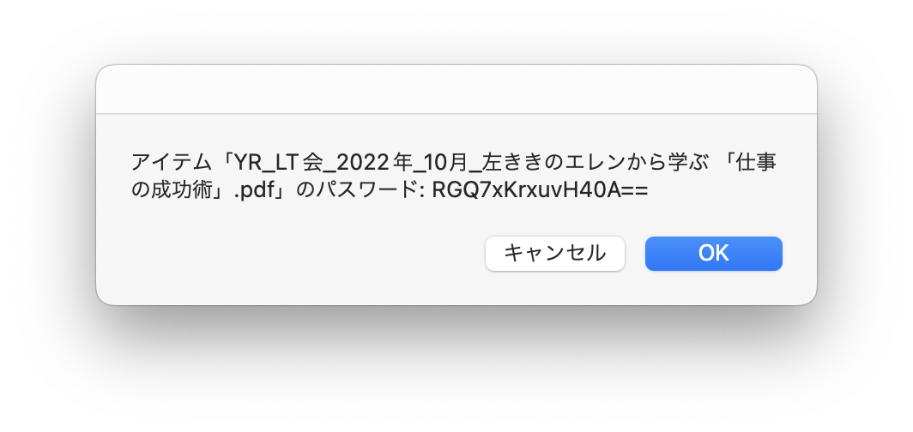
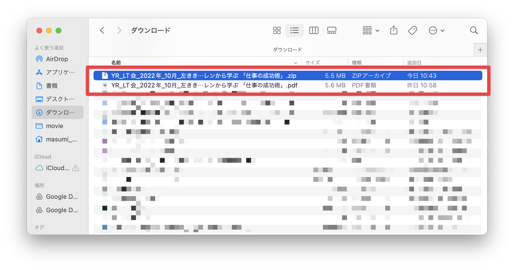
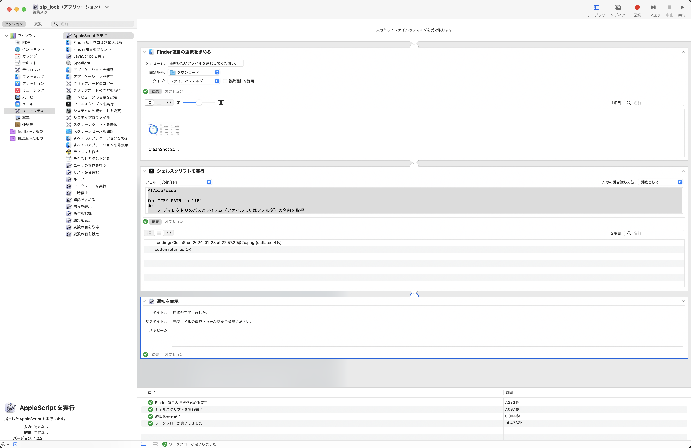
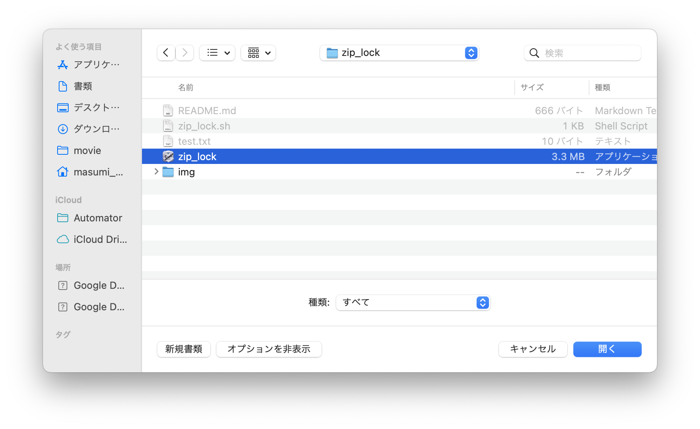

# Zip Lock

パスワード付きのZipファイルを作成するためのデスクトップアプリ（macOS）です。

- 対応OS：macOS
- 入力可能データ：ファイル、フォルダ

## 使用方法
1. zip_lock.zipを解凍して、アプリを起動する（同じディレクトリの中の`zip_lock.app`をダブルクリックする）。

※ もしもセキュリティで拒否されてしまった場合は、「システム設定 > プライバシーとセキュリティ > このまま開く」をクリックして、許可をします。

2. ファイル（もしくはフォルダ）を選択する。

3. パスワードが表示されるため、コピーする。

4. 元ファイルと同じディレクトリに、パスワード付きのZipファイルが作成されていることを確認する。

5. パスワードで解凍できることを確認する。

## 開発者向けメモ
AutomatorというmacOSのアプリで開発をしています。

現在の設定は以下の通りです。

また、Automatorのアプリを開き、以下のように「zip_lock.app」を選択して、「開く」を選択することで、アップデートをかけられます。

